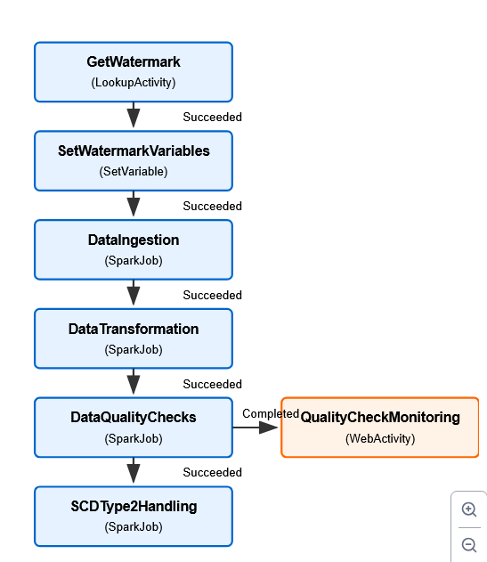

# Microfinance Data Engineering with Microsoft Fabric and Apache Spark

## Project Overview

This project demonstrates the creation and management of scalable data pipelines in the microfinance domain using Microsoft Fabric's Spark runtime. It simulates realistic workloads such as customer onboarding, loan data tracking, data quality enforcement, and SCD Type 2 history management.

## Pipeline Architecture



## Project Structure

```
/microfinance-data-engineering-fabric-spark
├── README.md
├── LICENSE
├── .gitignore
├── requirements.txt
├── run_pipeline.sh              # Pipeline orchestration entry point
├── src                          # PySpark pipeline components
│   ├── data_ingestion.py
│   ├── data_transformation.py
│   ├── data_quality_checks.py
│   └── scd_type2_handling.py
├── config
│   └── fabric_spark_pipeline.json   # Fabric pipeline definition
├── data
│   └── sample_data.csv          # Sample input data
└── docs
    └── diagrams
        ├── ADF_activities_flowchart.png
        └── SCD_type2.drawio
```

## Technologies Used
- Microsoft Fabric (Spark Runtime)
- PySpark
- Delta Lake
- Bash scripting (for pipeline orchestration)

## Core Capabilities

### 🔹 Ingestion
- Ingests microfinance domain data (e.g., customer, loan transactions) from CSV into a Lakehouse table.
- `data_ingestion.py` reads the raw CSV and writes it to a Delta table.

### 🔹 Transformation
- `data_transformation.py` performs cleaning, formatting, and joins for loan analysis.

### 🔹 Data Quality
- `data_quality_checks.py` verifies data integrity (null checks, schema validation).

### 🔹 SCD Type 2
- `scd_type2_handling.py` implements production-ready SCD Type 2 for tracking historical changes to customer and loan attributes
- Features Delta Lake integration, robust error handling, optimized performance, and comprehensive monitoring
- Configurable through notebook parameters in Microsoft Fabric

## How to Run

### Option 1: Shell Script (Recommended for Fabric)
The shell script orchestrates the pipeline components in sequence:

```bash
# Run with default parameters (dev environment)
./run_pipeline.sh

# Run with specific environment and date
./run_pipeline.sh prod 2025-04-11
```

### Option 2: Manual Execution
```bash
python src/data_ingestion.py data/sample_data.csv fabric_ingested_data/parquet_data fabric_ingested_data/error_data
python src/data_quality_checks.py fabric_ingested_data/parquet_data fabric_data_quality_report.json
python src/data_transformation.py fabric_ingested_data/parquet_data fabric_transformed_data/parquet_data
python src/scd_type2_handling.py fabric_transformed_data/parquet_data fabric_dim_data fabric_dim_data
```

### Option 3: Microsoft Fabric Execution
- Import the pipeline configuration from `config/fabric_spark_pipeline.json`
- Configure parameters using Fabric's interface
- Schedule execution using Fabric Pipelines

## Microsoft Fabric Integration
- The pipeline is optimized for Microsoft Fabric's Delta Lake integration
- Use Fabric's built-in scheduling and monitoring capabilities
- Configure environment-specific parameters through Fabric's interface

## Development and Testing
- Use shell scripts for local development and testing
- Run tests locally before deploying to Fabric

## Outcome
- Version-controlled, production-ready PySpark pipelines for microfinance analytics
- Robust SCD Type 2 implementation with Delta Lake for ACID transactions
- Compatible with Microsoft Fabric's Lakehouse environment
- Pipeline orchestration using both Fabric's native tools and custom shell scripts