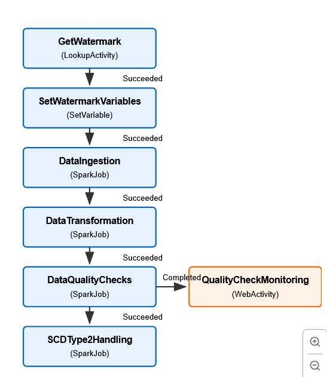

# Microfinance Data Engineering with Microsoft Fabric and Apache Spark

## Project Overview

This portfolio project demonstrates a tested local PySpark pipeline for microfinance data: customer and loan ingestion, data quality checks, payment calculations, and SCD Type 2 / Type 4 history management. The implementation stores data as Parquet and includes a Fabric-style orchestration reference for adapting the workflow to a Microsoft Fabric workspace. Fabric deployment has not been validated.

## What This Project Demonstrates

- **Batch pipeline design in PySpark**: ingestion with an enforced schema, invalid and malformed rows routed to an error table, a data quality report, and loan transformations (amortized monthly payment, loan size category).
- **Slowly changing dimensions, two ways**: SCD Type 2 (versioned rows with effective dates) and SCD Type 4 (current table plus history table), built on the same change detection so the trade-offs can be compared directly.
- **Safe re-runs**: every step processes one `process_date` batch and replaces only that batch's output, so re-running a date never duplicates data.
- **History protection**: batches must be applied in date order, an already-applied batch can only be re-run with identical data, and dimension tables are replaced through a staging copy that is recovered automatically if a run is interrupted.
- **Testing**: 45 pytest tests on a local Spark session, covering normal runs, re-runs, empty batches, and failure and crash scenarios.

## Pipeline Architecture



*Activities of the Fabric-style orchestration reference (`config/fabric_spark_pipeline.json`). The local `run_pipeline.sh` runs the same steps, with data quality checks before the transformation.*

## Project Structure

```
/microfinance-data-engineering-fabric-spark
├── README.md
├── LICENSE
├── .gitignore
├── requirements.txt
├── run_pipeline.sh              # Pipeline orchestration entry point
├── pytest.ini
├── src                          # PySpark pipeline components
│   ├── common.py                # Shared SCD config, dedup, change detection, safe overwrite
│   ├── data_ingestion.py
│   ├── data_transformation.py
│   ├── data_quality_checks.py
│   ├── scd_type2_handling.py
│   └── scd_type4_handling.py
├── config
│   └── fabric_spark_pipeline.json   # Fabric-style orchestration reference
├── data
│   └── sample_data.csv          # Sample input data
├── tests                        # pytest suite (local Spark session)
└── docs
    └── diagrams
        ├── ADF_activities_flowchart.png
        ├── SCD_type2.drawio
        └── SCD_type4.drawio
```

## Technologies Used
- Microsoft Fabric (deployment target and orchestration reference)
- PySpark
- Parquet (current storage format); Delta Lake dependencies for future integration
- Bash scripting (for pipeline orchestration)

## Core Capabilities

### 🔹 Ingestion
- Ingests microfinance domain data (e.g., customer, loan transactions) from CSV into the Lakehouse.
- `data_ingestion.py` reads the raw CSV with an enforced schema, routes invalid and malformed rows to an error path, and writes valid rows as Parquet partitioned by `process_date`.
- Re-running the same `process_date` replaces that batch (dynamic partition overwrite) instead of appending a duplicate.

### 🔹 Transformation
- `data_transformation.py` calculates monthly payments and loan categories for a `process_date` batch, replacing that batch on re-run. A run audit log is written next to the output (`<output>_audit`).

### 🔹 Data Quality
- `data_quality_checks.py` verifies data integrity (null checks, value ranges, allowed statuses) and writes a JSON report plus the offending records.

### 🔹 SCD Type 2
- `scd_type2_handling.py` implements SCD Type 2 for tracking historical changes to customer and loan attributes
- Takes the latest version of each key (by `last_updated`), uses null-safe change detection, and only expires keys present in the incoming batch
- Rewrites the dimension through a staging directory, so reading and replacing the same path is safe, and recovers an interrupted swap on the next run

### 🔹 SCD Type 4
- `scd_type4_handling.py` implements the alternative history-table pattern: a compact *current* table (one row per business key) plus an append-only *history* table of superseded versions
- Shares the same dimension configs (customer, loan) and change-detection logic as the Type 2 module, so the two strategies are directly comparable
- History appends skip versions that are already archived, so retrying a failed run doesn't duplicate history
- Selectable at run time via the pipeline's `scd_type` parameter

**Choosing between Type 2 and Type 4:**

| | SCD Type 2 (in-table versioning) | SCD Type 4 (current + history tables) |
|---|---|---|
| Storage | One table with `effective_start/end_date`, `is_current` | `dim_*_current` + `dim_*_history` |
| Serving queries | Must filter `is_current = true` | Hit the small current table directly |
| Point-in-time joins | Natural (date-range join in one table) | Query the history table |
| Best when | History is queried as often as current state | Dashboards mostly need latest state; history is audit/compliance |

## How to Run

Install the dependencies in a Python virtual environment first (see Development and Testing below). Java must be available on `PATH`, or through `JAVA_HOME`.

### Option 1: Local Shell Pipeline
The shell script orchestrates the pipeline components in sequence. Prepare its sample input path once:

```bash
mkdir -p Files/raw_data/dev
cp data/sample_data.csv Files/raw_data/dev/sample_data.csv
```

```bash
# Run with default parameters (dev environment, SCD Type 2)
bash run_pipeline.sh

# Run with specific environment and date
bash run_pipeline.sh prod 2025-04-11

# Run with SCD Type 4 (current + history tables) instead of Type 2
bash run_pipeline.sh dev 2025-04-11 4
```

The bundled sample produces five ingested rows, five customer dimensions, and five loan dimensions with zero quality errors. Outputs are written under `Files/fabric_data/dev/`. The `prod` example requires your own dated input file and Spark environment.

The date is the batch's `process_date`. Every step works on that batch only:
- Ingestion, transformation and data quality replace that date's output on a re-run, including clearing it when the re-run has no rows for it.
- The SCD step applies only that date's transformed batch, using the date as the effective date. Dimensions must be built in date order: before changing a dimension, the step records the batch date and a fingerprint of the batch's rows in `<table>__watermark` (including batches that change nothing). Re-running that date with identical data is safe (e.g. a retry after a failure). Applying an older date is refused, and so is re-running the latest date with different data (rows added, changed, removed, or an empty batch) once any of that date's changes are in the table, since either would corrupt the history.

Any failing step exits non-zero, which stops the script. Dimension tables are replaced by writing a staging copy and swapping it in, keeping the previous version until the swap completes; the next run recovers an interrupted swap automatically, even if its batch is empty.

### Option 2: Manual Execution
```bash
python src/data_ingestion.py data/sample_data.csv fabric_ingested_data/parquet_data fabric_ingested_data/error_data 2025-04-11
python src/data_quality_checks.py fabric_ingested_data/parquet_data fabric_reports/quality_report.json 2025-04-11
python src/data_transformation.py fabric_ingested_data/parquet_data fabric_transformed_data/parquet_data 2025-04-11
python src/scd_type2_handling.py fabric_transformed_data/parquet_data fabric_dim_data fabric_dim_data 2025-04-11

# Or SCD Type 4 (writes dim_*_current and dim_*_history tables)
python src/scd_type4_handling.py fabric_transformed_data/parquet_data fabric_dim_data/current fabric_dim_data/history 2025-04-11
```

### Option 3: Adapting the Workflow to Microsoft Fabric
- Use `config/fabric_spark_pipeline.json` as an illustrative orchestration reference; it is not a validated Fabric deployment export.
- Create the referenced Spark jobs and datasets in your workspace, and include `src/common.py` with the entry scripts.
- Set `processDate` to the batch's `YYYY-MM-DD` date for each run. The template passes it to every Spark step, matching the command-line examples above.
- Configure Lakehouse paths, adapt the reference to the pipeline format supported by your workspace, and replace or remove the placeholder notification endpoint before scheduling.

### Correcting a batch that was already applied
Corrected data for a date the SCD step has already applied can't be patched in place. Replay the dimensions instead: the transformed data is kept per date, so the history can be rebuilt from it.

```bash
# 1. Re-run ingestion, quality checks and transformation for the corrected date (replaces that batch)
# 2. Drop the dimension tables and their watermarks (SCD Type 2 shown; for Type 4, drop
#    dim_*_current, dim_*_current__watermark and dim_*_history)
rm -r Files/fabric_data/dev/dim_data/dim_customer* Files/fabric_data/dev/dim_data/dim_loan*
# 3. Re-apply every batch date in order
for d in 2025-04-11 2025-04-12; do
  spark-submit src/scd_type2_handling.py Files/fabric_data/dev/transformed_data Files/fabric_data/dev/dim_data Files/fabric_data/dev/dim_data $d
done
```

## Microsoft Fabric Integration
- The local implementation uses Parquet; it does not provide Delta Lake transactions.
- The reference template illustrates dependencies, batch-date parameters, and scheduling for a Fabric adaptation.
- Workspace authentication, job deployment, OneLake access, and scheduling require validation in an actual Fabric workspace.

## Example: What a Customer Update Does

Suppose customer `C1` has an annual income of 1,000 on `2025-01-01`, then 2,000 in the `2025-02-01` batch. SCD Type 2 keeps both versions:

| Customer | Annual income | Effective start | Effective end | Current |
|---|---:|---|---|---|
| C1 | 1,000 | 2025-01-01 | 2025-02-01 | false |
| C1 | 2,000 | 2025-02-01 | 9999-12-31 | true |

SCD Type 4 keeps the 2,000 row in the current table and archives the 1,000 row in a separate history table. Customers absent from the February batch stay current. These behaviors are exercised in `tests/test_scd_type2.py` and `tests/test_scd_type4.py`.

## Development and Testing
The test suite runs every step against a local Spark session. It is validated with Python 3.10 and Java 11; Spark 3.5 also supports Java 17.

```bash
python -m venv .venv
source .venv/bin/activate
pip install -r requirements.txt
pytest
```

The tests cover schema enforcement and error routing, re-run idempotency, failure propagation, and the SCD Type 2 / Type 4 cases that matter (changed, new, and absent keys; latest-version-wins; null-to-value changes; one batch per date, date-order enforcement including empty batches before or after the first load, and refusal of re-runs with different data; recovery from an interrupted table swap or a failed run). An integration test runs the real steps using the reference template's arguments and verifies their rows and effective dates.

## Outcome
- A reproducible local PySpark portfolio demonstration for microfinance analytics
- Tested SCD Type 2 and Type 4 implementations
- Sample data and a before/after history example
- Local shell orchestration and an illustrative Microsoft Fabric reference template
